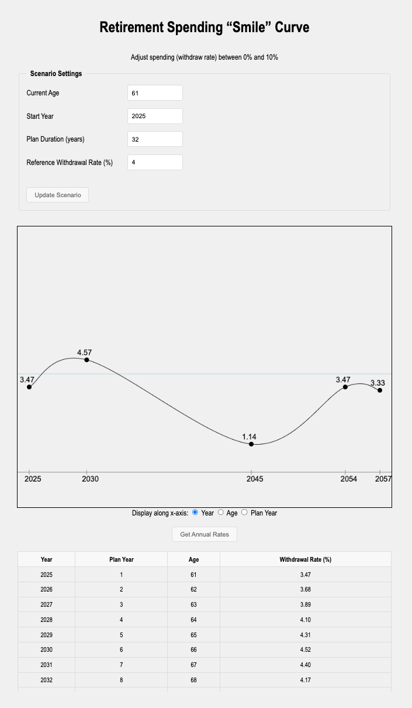

# Retirement Spending &ldquo;Smile&rdquo; Curve

A dynamic tool to help plan your retirement spending strategy using the &ldquo;Smile&rdquo; curve concept - a research-backed approach showing that retirees typically spend more in early retirement (active years), less in middle retirement (slower years), and more again in late retirement (healthcare years).

Try [Live Demo Here](https://buzcarter.github.io/spending-smile-graph/)

## How it Works

1. Enter your retirement details:
   - **Age** when retiring
   - **Year** you plan to retire
   - **Duration** of your retirement plan
   - **Constant Withdraw Rate** as a reference line (e.g., 4%)

2. Use the interactive graph to:

   - View the classic "smile" curve pattern
   - Drag points to customize spending levels for different phases of retirement
   - Toggle between viewing by calendar year, age, or years into retirement
   - Generate a detailed table of annual withdrawal rates

## Why a "Smile" Pattern?

The retirement spending smile reflects real-world spending patterns:

- **Early Phase**: Higher spending on travel, hobbies, and lifestyle
- **Middle Phase**: Reduced activity and spending as energy levels naturally decline
- **Later Phase**: Increased spending due to healthcare and assistance needs

This tool helps you visualize and plan for these natural spending variations rather than assuming a constant withdrawal rate throughout retirement.

